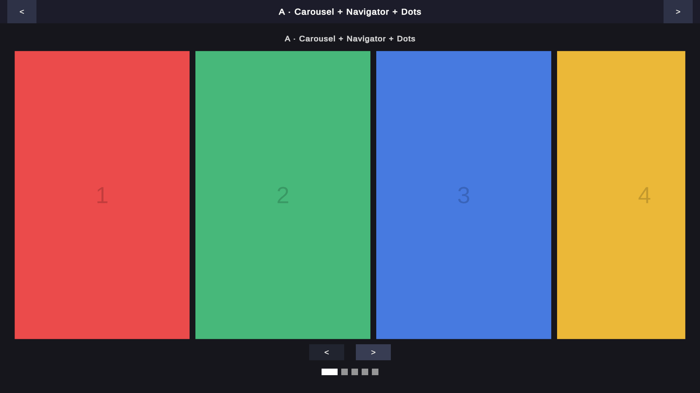
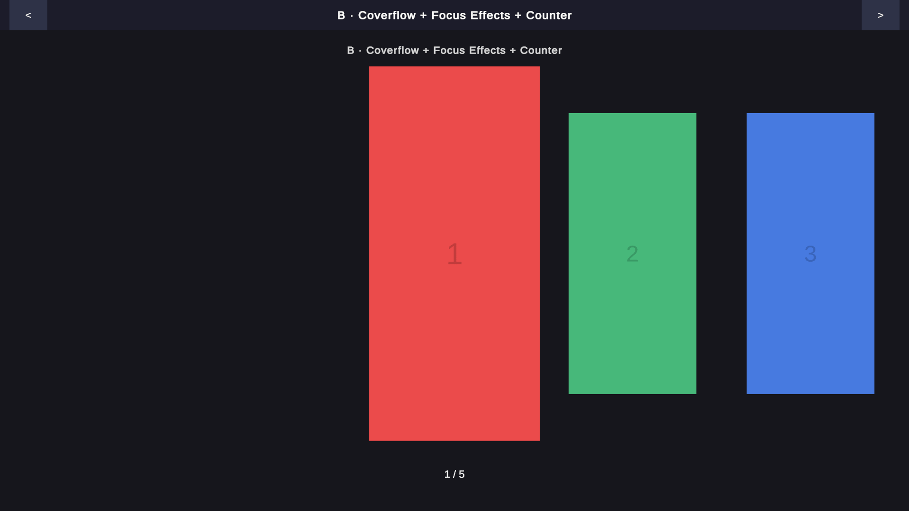
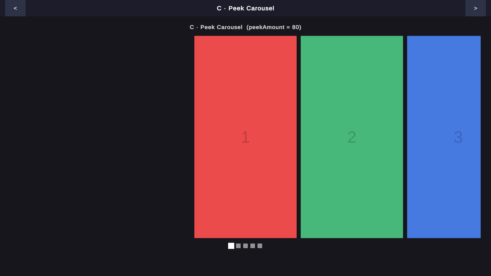
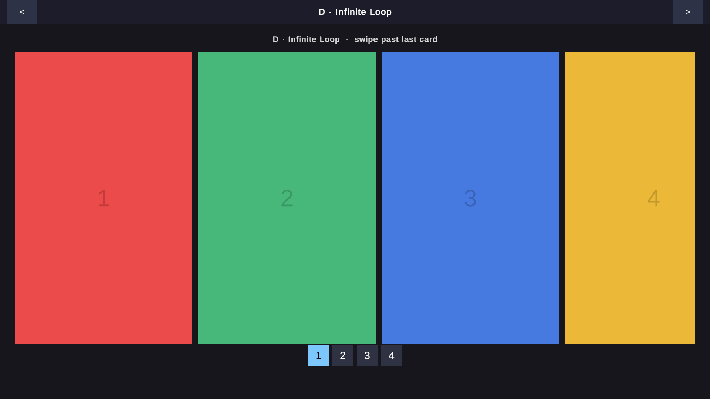
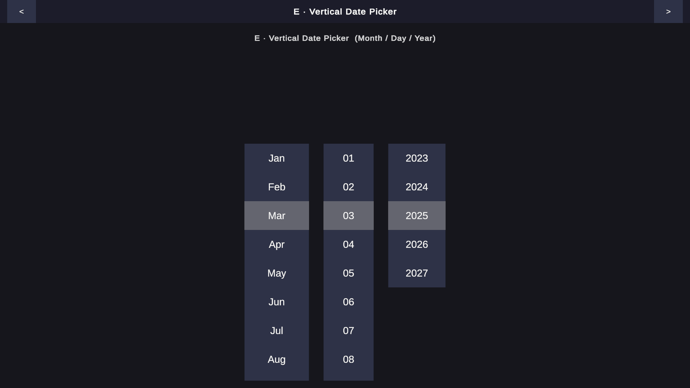

# KidzDev Unity Scroll Snap

A lightweight `ScrollRect`-based snap pager for Unity uGUI — horizontal carousel, vertical picker, indicators, focus effects, and more.

**Unity 6000.0+** · **UPM package** · **No third-party dependencies**

## Install

Add via **Package Manager → Add package from git URL**:

```
https://github.com/knabsiraphop/kidzdev-unity-addressables-toolkit.git?path=Packages/com.kidzdev.unity.scroll-snap#v0.1.0
```

Or add to `Packages/manifest.json`:

```json
"com.kidzdev.unity.scroll-snap": "https://github.com/knabsiraphop/kidzdev-unity-addressables-toolkit.git?path=Packages/com.kidzdev.unity.scroll-snap#v0.1.0"
```

## Demo

Import the **Demo** sample via *Package Manager → Samples* to try every feature in a single scene.

### A · Carousel + Navigator + Dots

Full-page horizontal carousel with `ScrollSnapNavigator` prev/next buttons and a pill-mode `DotIndicator`.



### B · Coverflow + Focus Effects + Counter

Center-aligned horizontal scroll with `ScrollSnapItemScaler` (focused card grows, neighbours shrink) and a `NumberIndicator` page counter.



### C · Peek Carousel

Same as the carousel but with `peekAmount = 80` — adjacent cards bleed in 80 px from each edge.



### D · Infinite Loop

`wrapAround = true` with a `PageButtonIndicator` row — swiping past the last card jumps seamlessly back to the first.



### E · Vertical Date Picker

Three independent vertical `ScrollSnap` columns (Month / Day / Year) with `SnapAlignment.Center` and a selection-highlight overlay.



## Quick Start

Add a `ScrollSnap` via **GameObject → UI → Scroll Snap** in the menu, or via script:

```csharp
// The ScrollSnap component lives on the same GameObject as the ScrollRect.
// Wire up an indicator by dropping it anywhere in the hierarchy —
// it resolves the target via GetComponentInParent<ScrollSnap>().
```

### `ScrollSnap` key properties

| Property | Default | Description |
|---|---|---|
| `axis` | `Horizontal` | Scroll axis |
| `alignment` | `Start` | `Start` = full-page; `Center` = coverflow / picker |
| `peekAmount` | `0` | Pixels of adjacent cards to expose (requires `Center`) |
| `wrapAround` | `false` | Seamless infinite loop |
| `snapDuration` | `0.3` | Snap animation duration in seconds |
| `snapCurve` | ease-in-out | `AnimationCurve` controlling the snap easing |

### Events

```csharp
snap.OnPageChanged   += (int page) => { };   // fires when the focused page changes
snap.OnSnapComplete  += (int page) => { };   // fires when the snap animation settles
snap.OnDragBegin     += ()         => { };
snap.OnFocusChanged  += (int page) => { };   // nearest page changes mid-drag
```

### Navigation

```csharp
snap.SnapToNext();
snap.SnapToPrev();
snap.SnapToPage(2);
snap.JumpToPage(0);   // instant, no animation
```

## Indicators

| Component | Description |
|---|---|
| `DotIndicator` | Row of dots; active dot can expand to a pill (`activePillWidth`); supports a windowed sliding window (`maxVisible`) |
| `NumberIndicator` | Single `"1 / 5"` text label |
| `PageButtonIndicator` | Row of numbered clickable buttons |

All indicators implement `IScrollSnapIndicator` and resolve their target via `GetComponentInParent<ScrollSnap>()` by default.

## Add-ons

| Component | Description |
|---|---|
| `ScrollSnapNavigator` | Wires prev/next `Button`s; disables them at the ends when `wrapAround` is off |
| `ScrollSnapAutoPlay` | Advances the carousel on a timer; pauses on drag, resumes after `resumeDelay` |
| `ScrollSnapItemScaler` | Drives `localScale` and `CanvasGroup.alpha` from focus distance; implements `IScrollSnapItem` |

## License

MIT
